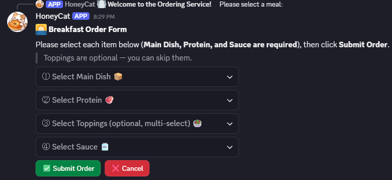
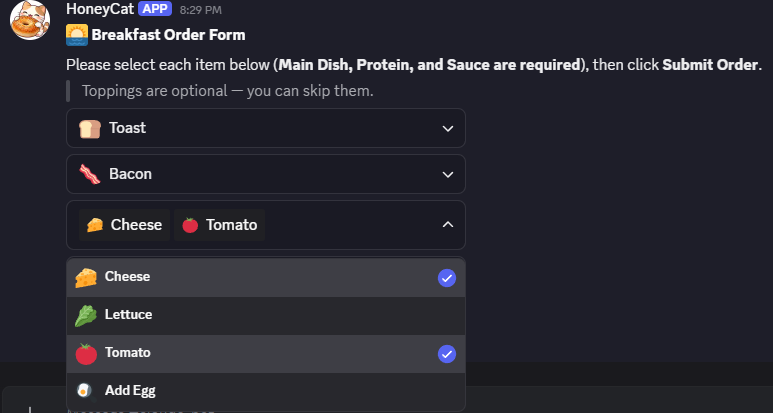
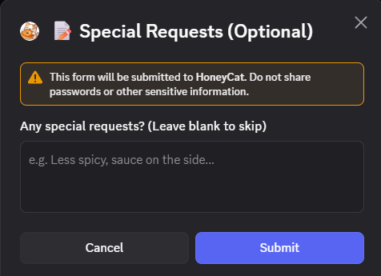
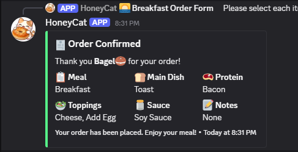

# Discord Claude Bot — AI Assistant & Food Ordering Bot

A Discord bot powered by Claude AI, featuring intelligent conversation and an interactive food ordering system built with discord.js v14.

---
## 🤖 Features

**AI Conversation**

- Mention the bot (`@bot`) in any server channel to start a conversation
- Send a direct message (DM) to chat privately
- Maintains per-channel conversation history (last 20 message pairs)
- Powered by Anthropic's Claude AI model

**Food Ordering System**

- Trigger with `!點餐` or `!order` in any channel
- Interactive dropdown menus built with Discord UI components
- Supports breakfast ordering with the following customization:
  - Main dish: Toast / Egg Crepe / Croissant / Hamburger Bun
  - Protein: Bacon / Pork Patty / Hash Brown
  - Toppings (multi-select, optional): Cheese / Lettuce / Tomato / Egg
  - Sauce: Ketchup / Soy Sauce / Peanut Butter / Hot Sauce / Butter / None
  - Optional notes via modal text input
- Displays a full order confirmation embed visible to the entire channel
- Lunch option coming soon

---
## 📁 Project Structure

```
discord-claude-bot/
├── index.js        # Main entry point — Discord client, message & interaction handlers
├── order.js        # Food ordering module — menus, session management, UI components
├── menu.txt        # Menu configuration — edit this to update the ordering menu
├── package.json    # Dependencies and scripts
├── .env            # Environment variables (not committed)
└── .env.example    # Environment variable template
```

---
## 🍽️ Customizing the Menu

All menu items are defined in `menu.txt` — no coding required. Open it with any text editor and follow the format:

```
[Category Name]
Item Name, emoji
Item Name, emoji
```

Rules:
- Lines starting with `#` are comments and are ignored
- `[Category Name]` marks the start of a section — **do not rename these**
- Each item is one line: `name, emoji` (emoji is optional)
- To disable an item, add `#` at the start of the line
- Save the file and restart the bot for changes to take effect

---
## 🔧 Tech Stack

- **Runtime:** Node.js (ESM)
- **Discord Library:** discord.js v14
- **AI Provider:** Anthropic Claude (`@anthropic-ai/sdk`)
- **Config:** dotenv

---
## 🚀 Getting Started

1. Clone the repository and install dependencies:

```bash
npm install
```

2. Copy `.env.example` to `.env` and fill in your credentials:

```
DISCORD_TOKEN=your_discord_bot_token
ANTHROPIC_API_KEY=your_anthropic_api_key
```

3. Start the bot:

```bash
npm start
```

> **Note:** The Anthropic API requires separate billing from a Claude.ai subscription. Add credits at [console.anthropic.com](https://console.anthropic.com).

---
## ☕ Usage
1. Run the command **!order** in the chat. A selection menu will appear:


2. Choose your main dish, main ingredient, toppings (optional), sauce, and add notes (optional):



3. After submitting the order, the bot will repost the order details in the chat (visible to everyone):


---
## 👤 Author
Ricy Hsu

---
## 📅 Last Updated
April 8, 2026
